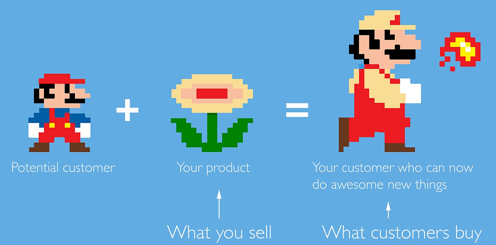
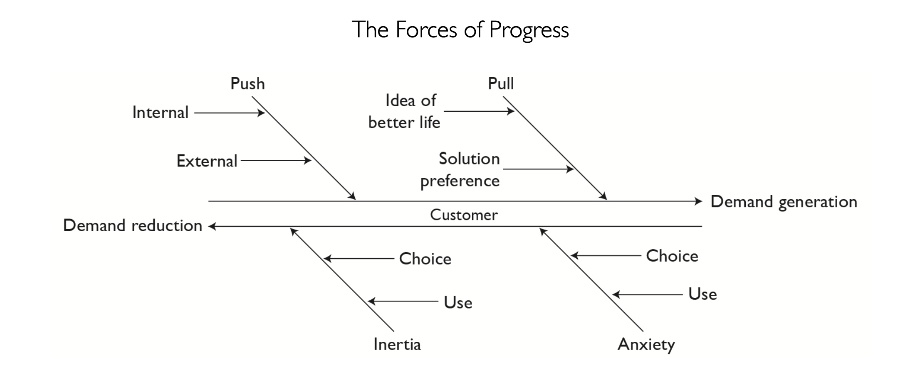

"The fist rule of marketing is you are not the customer."

–Mark Ritson

I believe an assumption has 3 dangerous qualities. The first is how terminating it is. A wrong assumption can easily end the existence of its maker in a particular context. Assume that your customers really want something. Invest heavily in it. To your surprise people react differently and don’t buy from you. You fail miserably. You’re out of business. The second is its unbounded harmfulness. This simply means that your wrong assumptions could harm unboundedly —unless you intentionally set its bounds. The third is its attractiveness. An assumption could evolve into becoming so seductive. Our imagination is capable of building a parallel reality that’s based on the assumption, pun intended, that our assumption must be true.

With that in mind it’s obvious how much of a bad practice it is to believe you already know what people want. I understand that there’re many reasons to not want to understand what people want. People themselves don’t know. And so you can’t go and ask them. But you could rightly wish this was the case. In addition, customer research could be seen as a waste of time. It’s really difficult to get it right. And we’ll end up with another assumption anyway. So why bother?

Partly wrong. Yes you’ll end up with another assumption. But it’s a night-and-day difference. When your starting point is ignoring the customer, you already lost, you lack strategic direction and after failing you won’t have any insight to help you calibrate your direction and win the next time; however, when your starting point is unearthing customers’ needs, you’ve set a strategic direction for what’s coming, and even if you’re wrong, the insights you gain will help you calibrate your direction to a better, more profitable need.

So if we agree that an uninformed assumption is dangerous, and we can’t be informed about customers’ needs by simply asking them, then we need a way to help us understand how to deal with this, dare I say, wicked problem.

## Introducing Jobs-To-Be-Done

Around 5 years ago I saw a short video of a charismatic professor talking about milkshakes. It was kind of a different language for me. He described what the product helps its customers achieve as a “job-to-be-done”. A customer hires a product to complete a job. The product that better helps at the job —“better” is defined by the customer— wins him over.

As simple as it was, the video impressed me. The JTBD framework provided me with a precious toolkit to use whenever I need to understand my customer’s world. But even more precious is how it enables us to understand people’s needs in its context. Now we don’t need to wonder what people really want. Instead we can aim to understand the job they want to get done, its context and the different elements that affect it positively or negatively.

It’s important to note here that there’s a number of variations of JTBD out there. One of the most popular ones is that of Anthony W. Ulwick. I found his ideas a bit over-engineered for my likings so I stick with the core theory and the work of people like Alan Klement and Bob Moesta. You’re, for sure, free to discover the different variations and decide which one suits your needs better.

This image from Alan Klement’s book When Coffee and Kale Compete that explains the framework pretty well:

I’m sorry I don’t know the details of Mario’s plot. But I know he’s trying to save a girl, perhaps some kind of a queen. And that he’s faced by some evil beings. The product, a magical flower, augments Mario’s power and helps him get the job done. A good product helps the customer in the same spirit.

## Poor man’s guide to doing JTBD research

There’re 4 main forces that directly affect a job, illustrated in the diagram below:

The first 2 are positive forces that generate demand. A push is a force towards a need or a desire. Without leading you to a specific solution, a push spikes your interest in a general category. On the other hand, a pull is a force that favors a specific solution over the others. If you feel hungry, it’s a push towards the general category of eating. If you then feel like you wanna eat sushi, it’s a pull towards the Asian cuisine.

The second 2 are negative forces that reduce demand. Inertia is a force advocating the current state of affairs. It wants nothing changed. Next time you try to change anything in your life notice the many reasons that arise in your mind to stop you from doing it. This is the force of inertia. Anxiety, on the other hand, isn’t about your old habits, but your novel choices. Which service to choose? How to know if our choice is right? Will it really help us or will we end up same as before?

As I’m leaning on the practical side of things, I won’t dive into more details. But Alan Klement has a more elaborate explanation of the different forces in his book, which I recommend full-heartedly.

Now the way to unearth insights regarding the job’s forces is to interview people. This isn’t an article about how to interview people per se, but I’ll try to summarize a couple of insights that helped me conduct better JTBD interviews over the years.

In an event, the name of which I don’t remember, I watched Bob Moesta interview someone on the spot to show how to properly conduct JTBD interviews. One thing that grabbed my attention is how he tried to take the interviewee to the moment of purchase. It was like an interrogation, but frendlier; when was that? With whom did you go shopping? What happened before? For the narrow-minded, such questions may seem unnecessary. But I believe they’re of utmost importance. Why? Well, context. Context is the glue that joins reality together. If you ignore it, prepare yourself for paying the dues of working with an incoherent reality.

Another thing I appreciated when watching the interview was how Bob was able to direct the interview without directing how the interviewee answered. When you’re looking for an answer, try to restrain yourself from asking a yes/no question and favor an open-ended version instead. Sure this doesn’t apply to everything, but when trying to understand people’s reality, I found yes/no questions to be of little help.

A final tip is to read Never Split the Difference by Chris Voss. Just read it and you’ll become a better interviewer. But if you’re in a hurry and know Egyptian Arabic, read my little negotiation guide for a start.

One last thing is missed: what actually are the questions to conduct JTBD interviews with? Well, after a lot of research I’ve found the question list made by Jim Kalbach in his playbook to be a solid foundation. [Here’s a link to the questions](https://docs.google.com/document/d/17UfN5hKsfdgvvHyD2F6FWdgXrQBolgno1f8Cza64AP0/edit?usp=sharing).

Ramadan Kareem everyone!
