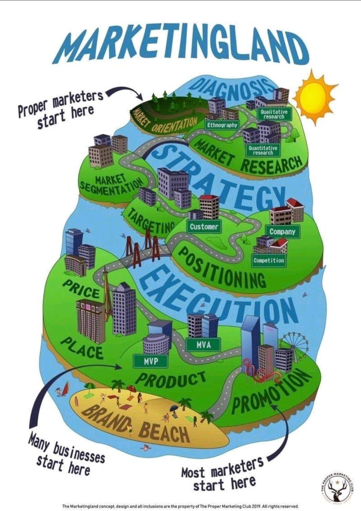

In the [series preface](https://muhammadisayyed.github.io/articles/discovery-vs-domain-dependence/) we made a comparison between domain-dependent marketers and discovery-led ones. And we chose a side. In this intro we’re going to lay down the fundamental pillars upon which we’ll establish all of what’s coming.

## Research & the illusion of confidence

Most managers I worked with either perceive research as “completely useless” or as a risk-reduction tool. Those who see it as a useless endeavor believe in the power of acting rapidly and testing everything instead of thinking, then acting. But they’re also those who over-intervent the most. They mistake haphazardness for agility and it costs them. Big time. On the other hand, those who aim to reduce risk with the magic stick of research spend their budget in vain. As per my understanding (and please correct me if I’m wrong) statistical significance doesn’t guarantee results nor reduce risk. And although research providers don’t promise this, many people just assume it. Maybe one of the reasons for that is what I call the “homework-grade” effect. People sometimes think of research as “homework”, and results as “grades”, and we’re accustomed to directly tie doing our homework to getting the results we aspire for. But I digress.

I believe that both parties didn’t get the point of research and deal with it either according to prejudice or habit.

## Research enables marketing

I love this diagram. And I agree with almost all of it. But there’s something about setting research as a separate island that just troubles me. I believe that it’d be better to be a waterfall instead, and the water flows through the entire diagram. This suits my idea of research way better.

I think of research as an enabler of the entire marketing process; thus, research being always present is paramount. While research, when done correctly, gives us a snapshot of our environment, an environment is forever evolving into something new. And so if you don’t want to wake up to find that you’re suddenly an alien in a completely different environment, you better watch out. And the way a marketer watches out is by constantly updating his snapshot of reality, through research.

## Research mindset & discovery

Do you see why research is such a mystery to us? Many marketers say we need to start with research, but what kind of research? How to do it, exactly? When to stop? There’s so many questions we need an answer for, and no matter how long you search you’re rewarded with very little insight.

The marketing industry is a mixture of whatever is capable of affecting it. Every industry has the opportunity of shaping what marketers could think of something. For example the term “growth marketing” is the baby of startups land. It took us a decade maybe to understand that whether you work at a startup or not, a marketer’s main goal is “growth”.

Research is the baby of the FMCG industry. I don’t know if it’s the first industry to use it, but I do know that most research providers tailor their services to match the needs of FMCG companies. And just like that, any company —no matter its scale, industry or goal— when first thinks of research, perceives in its FMCG-ian version. But this won’t be how we think in this series.

Our main goal here is to learn a handful of research tools to help us make sense of our environment. A company’s environment usually includes:

- the company itself,
- customers,
- competitors,
- and the market.

It’s fashionable to include other factors (economic, social, political, etc…), but as it’s way easier to deal with those, and I won’t call it part of our discovery process, but an information-gathering activity —I won’t deal with it.
